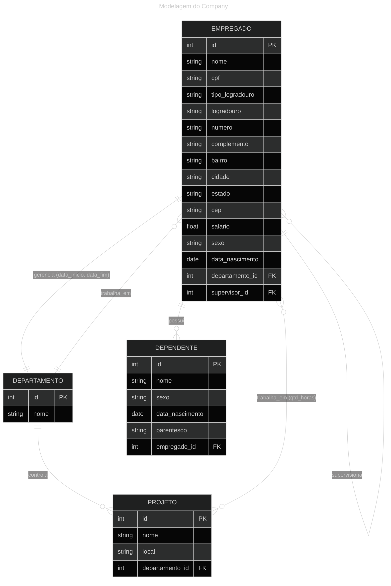

```mermaid
---
config:
  theme: dark
  layout: dagre
title: Modelagem do Company
---
erDiagram
	direction TB
	DEPARTAMENTO {
		int id PK ""
		string nome  ""
	}
	PROJETO {
		int id PK ""
		string nome  ""
		string local  ""
		int departamento_id FK ""
	}
	EMPREGADO {
		int id PK ""
		string nome  ""
		string cpf  ""
		string tipo_logradouro  ""
		string logradouro  ""
		string numero  ""
		string complemento  ""
		string bairro  ""
		string cidade  ""
		string estado  ""
		string cep  ""
		float salario  ""
		string sexo  ""
		date data_nascimento  ""
		int departamento_id FK ""
		int supervisor_id FK ""
	}
	DEPENDENTE {
		int id PK ""
		string nome  ""
		string sexo  ""
		date data_nascimento  ""
		string parentesco  ""
		int empregado_id FK ""
	}

	EMPREGADO||--||DEPARTAMENTO:"gerencia (data_inicio, data_fim)"
	DEPARTAMENTO||--o{PROJETO:"controla"
	EMPREGADO}o--||DEPARTAMENTO:"trabalha_em"
	EMPREGADO}o--o{PROJETO:"trabalha_em (qtd_horas)"
	EMPREGADO||--o{EMPREGADO:"supervisiona"
	EMPREGADO||--o{DEPENDENTE:"possui"

```
