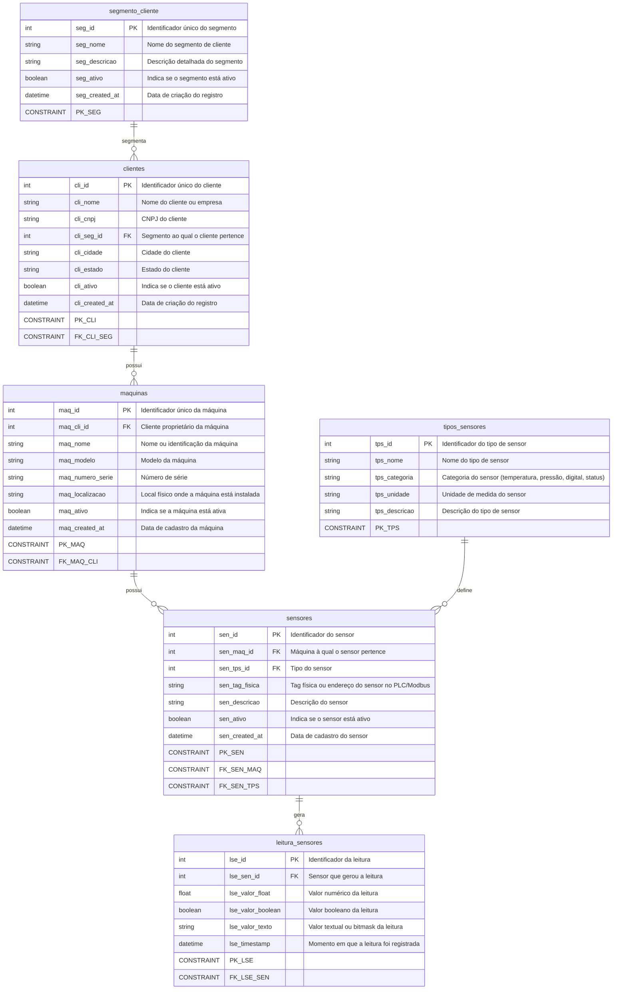

# Meu Markdown

```mermaid

erDiagram

    segmento_cliente ||--o{ clientes : "segmenta"
    clientes ||--o{ maquinas : "possui"
    maquinas ||--o{ sensores : "possui"
    tipos_sensores ||--o{ sensores : "define"
    sensores ||--o{ leitura_sensores : "gera"

    segmento_cliente {
        int seg_id PK "Identificador único do segmento"
        string seg_nome "Nome do segmento de cliente"
        string seg_descricao "Descrição detalhada do segmento"
        boolean seg_ativo "Indica se o segmento está ativo"
        datetime seg_created_at "Data de criação do registro"

        CONSTRAINT PK_SEG
    }

    clientes {
        int cli_id PK "Identificador único do cliente"
        string cli_nome "Nome do cliente ou empresa"
        string cli_cnpj "CNPJ do cliente"
        int cli_seg_id FK "Segmento ao qual o cliente pertence"
        string cli_cidade "Cidade do cliente"
        string cli_estado "Estado do cliente"
        boolean cli_ativo "Indica se o cliente está ativo"
        datetime cli_created_at "Data de criação do registro"

        CONSTRAINT PK_CLI
        CONSTRAINT FK_CLI_SEG
    }

    maquinas {
        int maq_id PK "Identificador único da máquina"
        int maq_cli_id FK "Cliente proprietário da máquina"
        string maq_nome "Nome ou identificação da máquina"
        string maq_modelo "Modelo da máquina"
        string maq_numero_serie "Número de série"
        string maq_localizacao "Local físico onde a máquina está instalada"
        boolean maq_ativo "Indica se a máquina está ativa"
        datetime maq_created_at "Data de cadastro da máquina"

        CONSTRAINT PK_MAQ
        CONSTRAINT FK_MAQ_CLI
    }

    tipos_sensores {
        int tps_id PK "Identificador do tipo de sensor"
        string tps_nome "Nome do tipo de sensor"
        string tps_categoria "Categoria do sensor (temperatura, pressão, digital, status)"
        string tps_unidade "Unidade de medida do sensor"
        string tps_descricao "Descrição do tipo de sensor"

        CONSTRAINT PK_TPS
    }

    sensores {
        int sen_id PK "Identificador do sensor"
        int sen_maq_id FK "Máquina à qual o sensor pertence"
        int sen_tps_id FK "Tipo do sensor"
        string sen_tag_fisica "Tag física ou endereço do sensor no PLC/Modbus"
        string sen_descricao "Descrição do sensor"
        boolean sen_ativo "Indica se o sensor está ativo"
        datetime sen_created_at "Data de cadastro do sensor"

        CONSTRAINT PK_SEN
        CONSTRAINT FK_SEN_MAQ
        CONSTRAINT FK_SEN_TPS
    }

    leitura_sensores {
        int lse_id PK "Identificador da leitura"
        int lse_sen_id FK "Sensor que gerou a leitura"
        float lse_valor_float "Valor numérico da leitura"
        boolean lse_valor_boolean "Valor booleano da leitura"
        string lse_valor_texto "Valor textual ou bitmask da leitura"
        datetime lse_timestamp "Momento em que a leitura foi registrada"

        CONSTRAINT PK_LSE
        CONSTRAINT FK_LSE_SEN
    }

```

## SIM!
- sim!
