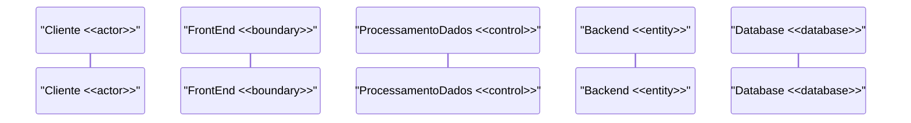

```mermaid
sequenceDiagram
    participant Cliente as "Cliente <<actor>>"
    participant FrontEnd as "FrontEnd <<boundary>>"
    participant ProcessamentoDados as "ProcessamentoDados <<control>>"
    participant Backend as "Backend <<entity>>"
    participant Database as "Database <<database>>"


```
