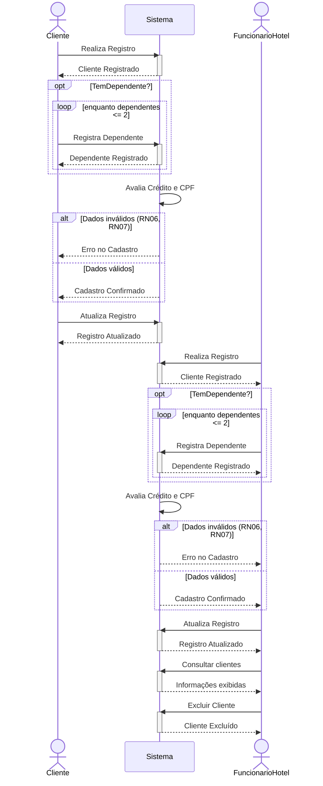

```mermaid
sequenceDiagram
    actor Cli as Cliente
    participant Sys as Sistema
    actor Func as FuncionarioHotel

    %% ================== %%
    %% INTERAÇÃO CLIENTE %%
    %% ================== %%
    %% REGISTRO DO CLIENTE (RF01, RF06)
    Cli ->> Sys: Realiza Registro
    activate Sys
    Sys -->> Cli: Cliente Registrado
    deactivate Sys

    %% RF06, RN03, RN04
    opt TemDependente?
        loop enquanto dependentes <= 2
            Cli ->> Sys : Registra Dependente
            activate Sys
            Sys -->> Cli : Dependente Registrado
            deactivate Sys
        end
    end

    Sys ->> Sys : Avalia Crédito e CPF
    alt Dados inválidos (RN06, RN07)
        Sys -->> Cli: Erro no Cadastro
    else Dados válidos
        Sys -->> Cli: Cadastro Confirmado
    end

    %% UPDATE DO CLIENTE (RF02)
    Cli ->> Sys: Atualiza Registro
    activate Sys
    Sys -->> Cli: Registro Atualizado
    deactivate Sys

    %% ===================== %%
    %% INTERAÇÃO FUNCIONARIO %%
    %% ===================== %%
    Func ->> Sys: Realiza Registro
    activate Sys
    Sys -->> Func: Cliente Registrado
    deactivate Sys

    opt TemDependente?
        loop enquanto dependentes <= 2
            Func ->> Sys : Registra Dependente
            activate Sys
            Sys -->> Func : Dependente Registrado
            deactivate Sys
        end
    end

    Sys ->> Sys : Avalia Crédito e CPF
    alt Dados inválidos (RN06, RN07)
        Sys -->> Func: Erro no Cadastro
    else Dados válidos
        Sys -->> Func: Cadastro Confirmado
    end

    %% UPDATE DO CLIENTE (RF02)
    Func ->> Sys: Atualiza Registro
    activate Sys
    Sys -->> Func: Registro Atualizado
    deactivate Sys

    %% Visualizar Cliente (RF04, RF05)
    Func ->> Sys : Consultar clientes
    activate Sys
    Sys -->> Func : Informações exibidas
    deactivate Sys

    %% Deletar Cliente (RF03)
    Func ->> Sys : Excluir Cliente
    activate Sys
    Sys -->> Func : Cliente Excluído
    deactivate Sys


```
