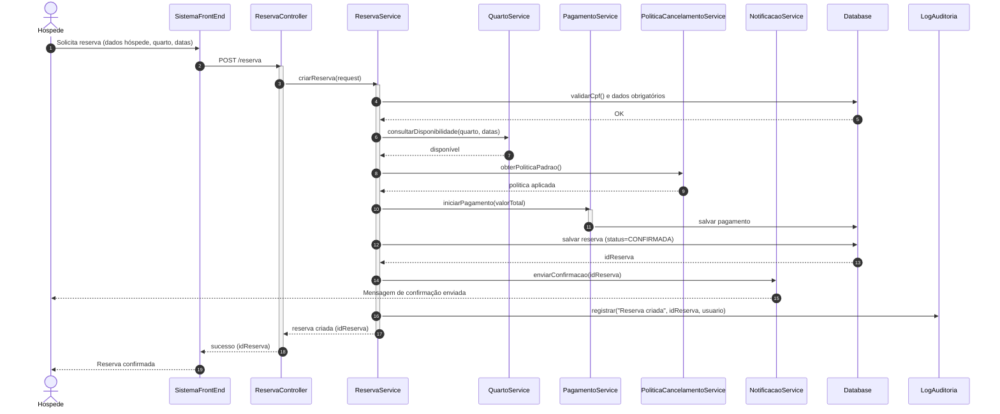

```mermaid
sequenceDiagram
    autonumber
    actor Hosp as Hospede
    participant Front as SistemaFrontEnd
    participant ResCtrl as ReservaController
    participant ResSvc as ReservaService
    participant QuartoSvc as QuartoService
    participant PmtSvc as PagamentoService
    participant PoliSvc as PoliticaCancelamentoService
    participant NotiSvc as NotificacaoService
    participant Repo as Database
    participant Log as LogAuditoria

    %% Hóspede inicia reserva
    Hosp ->> Front: Solicita reserva (dados hóspede, quarto, datas)
    Front ->> ResCtrl: POST /reserva
    activate ResCtrl

    %% Validação de dados
    ResCtrl ->> ResSvc: criarReserva(request)
    activate ResSvc
    ResSvc ->> Repo: validarCpf() e dados obrigatórios
    Repo -->> ResSvc: OK

    %% Verificação de disponibilidade
    ResSvc ->> QuartoSvc: consultarDisponibilidade(quarto, datas)
    QuartoSvc -->> ResSvc: disponível

    %% Política de Cancelamento obrigatória
    ResSvc ->> PoliSvc: obterPoliticaPadrao()
    PoliSvc -->> ResSvc: politica aplicada

    %% Pagamento
    ResSvc ->> PmtSvc: iniciarPagamento(valorTotal)
    activate PmtSvc
    PmtSvc ->> Repo: salvar pagamento
    deactivate PmtSvc

    %% Reserva confirmada
    ResSvc ->> Repo: salvar reserva (status=CONFIRMADA)
    Repo -->> ResSvc: idReserva

    %% Notificação
    ResSvc ->> NotiSvc: enviarConfirmacao(idReserva)
    NotiSvc -->> Hosp: Mensagem de confirmação enviada

    %% Log Auditoria
    ResSvc ->> Log: registrar("Reserva criada", idReserva, usuario)

    ResSvc -->> ResCtrl: reserva criada (idReserva)
    deactivate ResSvc
    ResCtrl -->> Front: sucesso (idReserva)
    deactivate ResCtrl
    Front -->> Hosp: Reserva confirmada
```
