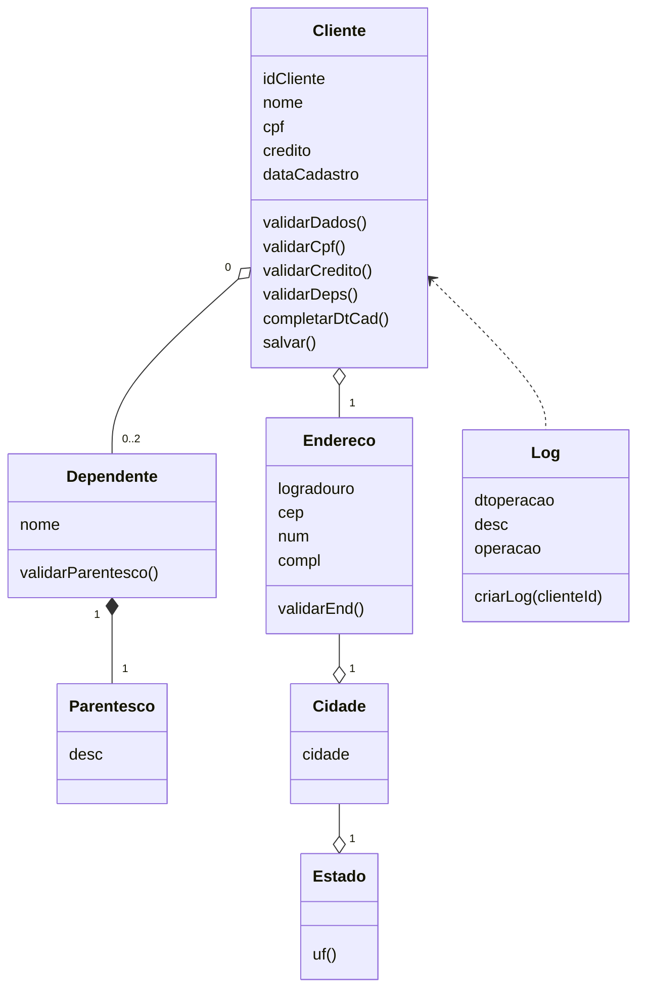

```mermaid
classDiagram
    class Cliente{
        idCliente
        nome
        cpf
        credito
        dataCadastro

        validarDados()
        validarCpf()
        validarCredito()
        validarDeps()
        completarDtCad()
        salvar()
    }

    class Dependente{
        nome
        validarParentesco()
    }

    class Parentesco{
        desc

    }

    class Endereco{
        logradouro
        cep
        num
        compl

        validarEnd()
    }

    class Cidade{
        cidade
    }

    class Estado{
        uf()
    }

    class Log{
        dtoperacao
        desc
        operacao

        criarLog(clienteId)
    }


    Cliente "0" o-- "0..2" Dependente
    Dependente "1" *-- "1" Parentesco
    Cliente  o-- "1" Endereco
    %% 1 endereco está relacionado a só uma cidade
    Endereco --o "1" Cidade
    %% 1 cidade está relacionada a só um estado
    Cidade --o "1" Estado
    Cliente <.. Log

```
