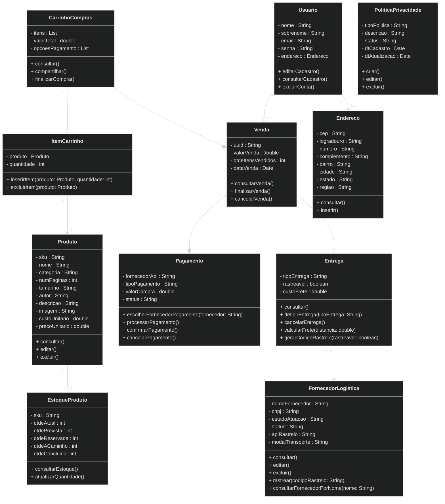

```mermaid
---
config:
  theme: dark
---
classDiagram
direction TB
    class CarrinhoCompras {
        - itens : List<ItemCarrinho>
        - valorTotal : double
        - opcoesPagamento : List<String>
        + consultar()
        + compartilhar()
        + finalizarCompra()
    }

    class ItemCarrinho {
        - produto : Produto
        - quantidade : int
        + inserirItem(produto: Produto, quantidade: int)
        + excluirItem(produto: Produto)
    }

    class Usuario {
        - nome : String
        - sobrenome : String
        - email : String
        - senha : String
        - endereco : Endereco
        + editarCadastro()
        + consultarCadastro()
        + excluirConta()
    }

    class Pagamento {
        - fornecedorApi : String
        - tipoPagamento : String
        - valorCompra : double
        - status : String
        + escolherFornecedorPagamento(fornecedor: String)
        + processarPagamento()
        + confirmarPagamento()
        + cancelarPagamento()
    }

    class Endereco {
        - cep : String
        - logradouro : String
        - numero : String
        - complemento : String
        - bairro : String
        - cidade : String
        - estado : String
        - regiao : String
        + consultar()
        + inserir()
    }
    class Produto {
        - sku : String
        - nome : String
        - categoria : String
        - numPaginas : int
        - tamanho : String
        - autor : String
        - descricao : String
        - imagem : String
        - custoUnitario : double
        - precoUnitario : double
        + consultar()
        + editar()
        + excluir()
    }

    class EstoqueProduto {
        - sku : String
        - qtdeAtual : int
        - qtdePrevista : int
        - qtdeReservada : int
        - qtdeACaminho : int
        - qtdeConcluida : int
        + consultarEstoque()
        + atualizarQuantidade()
    }

    class Venda {
        - uuid : String
        - valorVenda : double
        - qtdeItensVendidos : int
        - dataVenda : Date
        + consultarVenda()
        + finalizarVenda()
        + cancelarVenda()
    }

    class PoliticaPrivacidade {
        - tipoPolitica : String
        - descricao : String
        - status : String
        - dtCadastro : Date
        - dtAtualizacao : Date
        + criar()
        + editar()
        + excluir()
    }

    class Entrega {
        - tipoEntrega : String
        - rastreavel : boolean
        - custoFrete : double
        + consultar()
        + definirEntrega(tipoEntrega: String)
        + cancelarEntrega()
        + calcularFrete(distancia: double)
        + gerarCodigoRastreio(rastreavel: boolean)
    }

    class FornecedorLogistica {
        - nomeFornecedor : String
        - cnpj : String
        - estadoAtuacao : String
        - status : String
        - apiRastreio : String
        - modalTransporte : String
        + consultar()
        + editar()
        + excluir()
        + rastrear(codigoRastreio: String)
        + consultarFornecedorPorNome(nome: String)
    }

    %% --o: Agregação -> a parte NÃO depende do todo,
      %% mas o todo depende da parte


    %% --*: Composição -> a parte depende do todo
      %% e o todo depende da parte

    CarrinhoCompras "1" --o "0..n" ItemCarrinho
    ItemCarrinho "1" --> "1" Produto
    Produto "1" --o "1" EstoqueProduto
    CarrinhoCompras "1" --* "1" Venda
    Venda "1" --* "1..n" Pagamento
    Venda "1" --o "1" Entrega
    Usuario "1" --o "0..n" Venda
    Usuario "1" --> "0..n" Endereco
    Entrega "1..n" ..> "1" FornecedorLogistica


```
