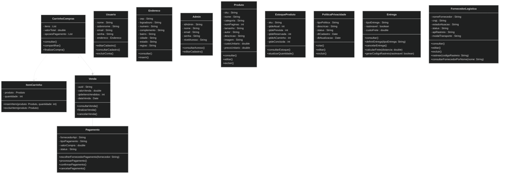

```mermaid
---
config:
  theme: dark
---
classDiagram
direction TB
    class CarrinhoCompras {
	    - itens : List
	    - valorTotal : double
	    - opcoesPagamento : List
	    +consultar()
	    +compartilhar()
	    +finalizarCompra()
    }
    class ItemCarrinho {
	    - produto : Produto
	    - quantidade : int
	    +inserirItem(produto: Produto, quantidade: int)
	    +excluirItem(produto: Produto)
    }
    class Usuario {
	    - nome : String
	    - sobrenome : String
	    - email : String
	    - senha : String
	    - endereco : Endereco
	    +editarCadastro()
	    +consultarCadastro()
	    +excluirConta()
    }
    class Pagamento {
	    - fornecedorApi : String
	    - tipoPagamento : String
	    - valorCompra : double
	    - status : String
	    +escolherFornecedorPagamento(fornecedor: String)
	    +processarPagamento()
	    +confirmarPagamento()
	    +cancelarPagamento()
    }
    class Endereco {
	    - cep : String
	    - logradouro : String
	    - numero : String
	    - complemento : String
	    - bairro : String
	    - cidade : String
	    - estado : String
	    - regiao : String
	    +consultar()
	    +inserir()
    }
    class Admin {
	    - idAdmin : String
	    - nome : String
	    - email : String
	    - senha : String
	    - nivelAcesso : String
	    +consultarAcesso()
	    +editarCadastro()
    }
    class Produto {
	    - sku : String
	    - nome : String
	    - categoria : String
	    - numPaginas : int
	    - tamanho : String
	    - autor : String
	    - descricao : String
	    - imagem : String
	    - custoUnitario : double
	    - precoUnitario : double
	    +consultar()
	    +editar()
	    +excluir()
    }
    class EstoqueProduto {
	    - sku : String
	    - qtdeAtual : int
	    - qtdePrevista : int
	    - qtdeReservada : int
	    - qtdeACaminho : int
	    - qtdeConcluida : int
	    +consultarEstoque()
	    +atualizarQuantidade()
    }
    class Venda {
	    - uuid : String
	    - valorVenda : double
	    - qtdeItensVendidos : int
	    - dataVenda : Date
	    +consultarVenda()
	    +finalizarVenda()
	    +cancelarVenda()
    }
    class PoliticaPrivacidade {
	    - tipoPolitica : String
	    - descricao : String
	    - status : String
	    - dtCadastro : Date
	    - dtAtualizacao : Date
	    +criar()
	    +editar()
	    +excluir()
    }
    class Entrega {
	    - tipoEntrega : String
	    - rastreavel : boolean
	    - custoFrete : double
	    +consultar()
	    +definirEntrega(tipoEntrega: String)
	    +cancelarEntrega()
	    +calcularFrete(distancia: double)
	    +gerarCodigoRastreio(rastreavel: boolean)
    }
    class FornecedorLogistica {
	    - nomeFornecedor : String
	    - cnpj : String
	    - estadoAtuacao : String
	    - status : String
	    - apiRastreio : String
	    - modalTransporte : String
	    +consultar()
	    +editar()
	    +excluir()
	    +rastrear(codigoRastreio: String)
	    +consultarFornecedorPorNome(nome: String)
    }

    CarrinhoCompras "0" ..> "n" ItemCarrinho
    CarrinhoCompras "0" --* "1" Venda
    Venda -- Pagamento

```