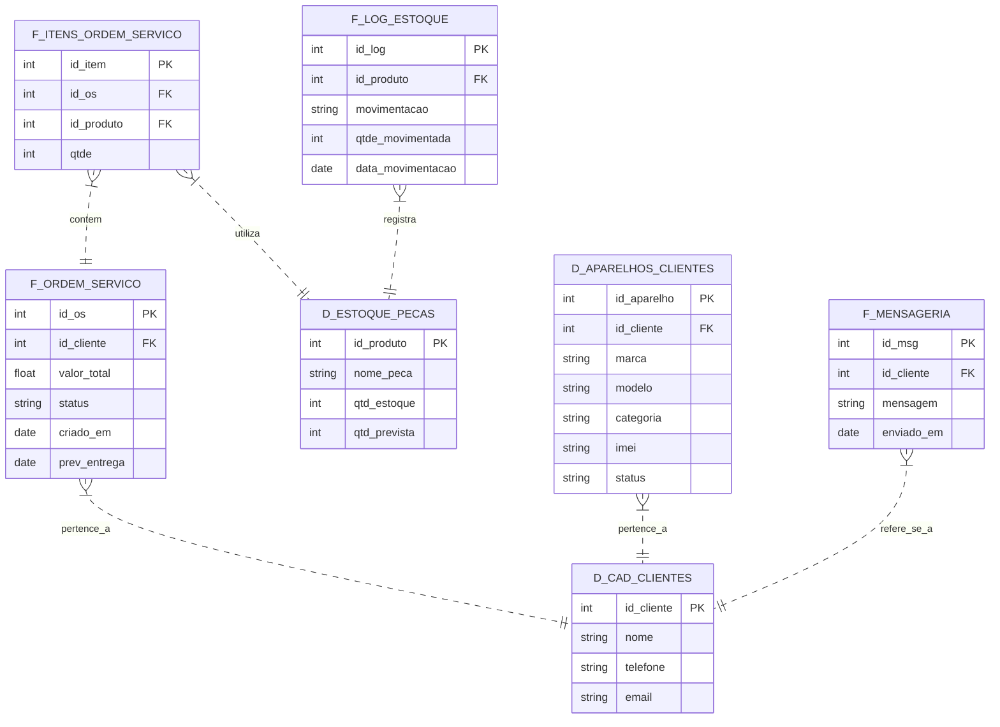

```mermaid
  erDiagram
    direction TB   %% Direção do diagrama (TB = Top to Bottom / de cima para baixo)

    %% =======================
    %% TABELA DE ORDENS DE SERVIÇO
    %% =======================
    F_ORDEM_SERVICO {
      int id_os PK
      int id_cliente FK
      float valor_total
      string status
      date criado_em
      date prev_entrega
    }

    %% =======================
    %% ITENS DA ORDEM DE SERVIÇO
    %% =======================
    F_ITENS_ORDEM_SERVICO {
      int id_item PK
      int id_os FK
      int id_produto FK
      int qtde
    }

    %% =======================
    %% ESTOQUE DE PEÇAS
    %% =======================
    D_ESTOQUE_PECAS {
      int id_produto PK
      string nome_peca
      int qtd_estoque
      int qtd_prevista
    }

    %% =======================
    %% APARELHOS DOS CLIENTES
    %% =======================
    D_APARELHOS_CLIENTES {
      int id_aparelho PK
      int id_cliente FK
      string marca
      string modelo
      string categoria
      string imei
      string status
    }

    %% =======================
    %% CADASTRO DE CLIENTES
    %% =======================
    D_CAD_CLIENTES {
      int id_cliente PK
      string nome
      string telefone
      string email
    }

    %% =======================
    %% LOG DE MOVIMENTAÇÃO DE ESTOQUE
    %% =======================
    F_LOG_ESTOQUE {
      int id_log PK
      int id_produto FK
      string movimentacao
      int qtde_movimentada
      date data_movimentacao
    }

    %% =======================
    %% MENSAGERIA (COMUNICAÇÃO COM CLIENTES)
    %% =======================
    F_MENSAGERIA {
      int id_msg PK
      int id_cliente FK
      string mensagem
      date enviado_em
    }

    %% =======================
    %% RELACIONAMENTOS
    %% =======================
    %% Uma ordem de serviço pertence a um cliente
    F_ORDEM_SERVICO }|..|| D_CAD_CLIENTES : "pertence_a"

    %% Uma OS pode conter vários itens, mas cada item pertence a apenas uma OS
    F_ITENS_ORDEM_SERVICO }|..|| F_ORDEM_SERVICO : "contem"

    %% Cada item da OS utiliza peças que estão no estoque
    F_ITENS_ORDEM_SERVICO }|..|| D_ESTOQUE_PECAS : "utiliza"

    %% Cada aparelho pertence a um cliente
    D_APARELHOS_CLIENTES }|..|| D_CAD_CLIENTES : "pertence_a"

    %% Cada movimentação registrada pertence a um produto do estoque
    F_LOG_ESTOQUE }|..|| D_ESTOQUE_PECAS : "registra"

    %% Cada mensagem se refere a um cliente específico
    F_MENSAGERIA }|..|| D_CAD_CLIENTES : "refere_se_a"


```
