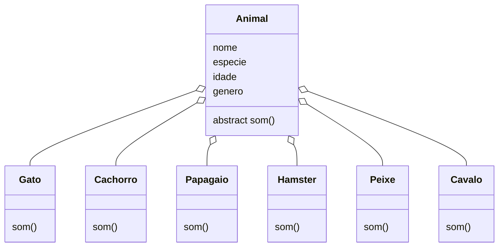

 # Trabalho Cadastro de Animais Crie um programa em Java que simule um sistema de cadastro de animais de estimação. O usuário poderá: - Cadastrar animais (Cachorro, Gato, Papagaio, Hamster,Peixe,Cavalo). - Ver a lista de animais cadastrados. - Ver os sons que os animais fazem (polimorfismo). Encerrar o programa. O sistema deve utilizar as bibliotecas do JavaSwing/JavaFx e aplicar herança, sobrecarga, sobrescrita e polimorfismo.

