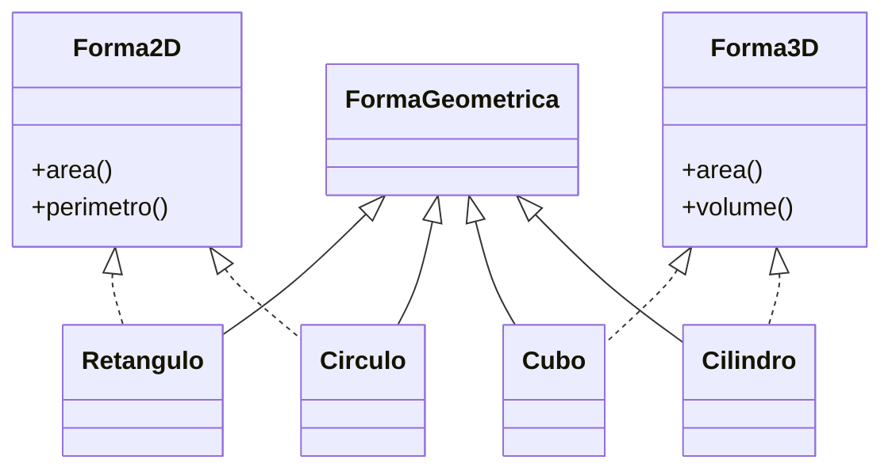

Crie uma classe chamada formasgeometrica
ela tera os metodos area , perimetro, volume

em seguida, você deve criar as seguintes classes que herdam os atributos de formageometrica :

retangulo
circulo
quadrado
pentagono
hexagono
triangulo

Cada objeto deverá ter seu método para calcular a área e o perímetro.

# Arquitetura proposta:

