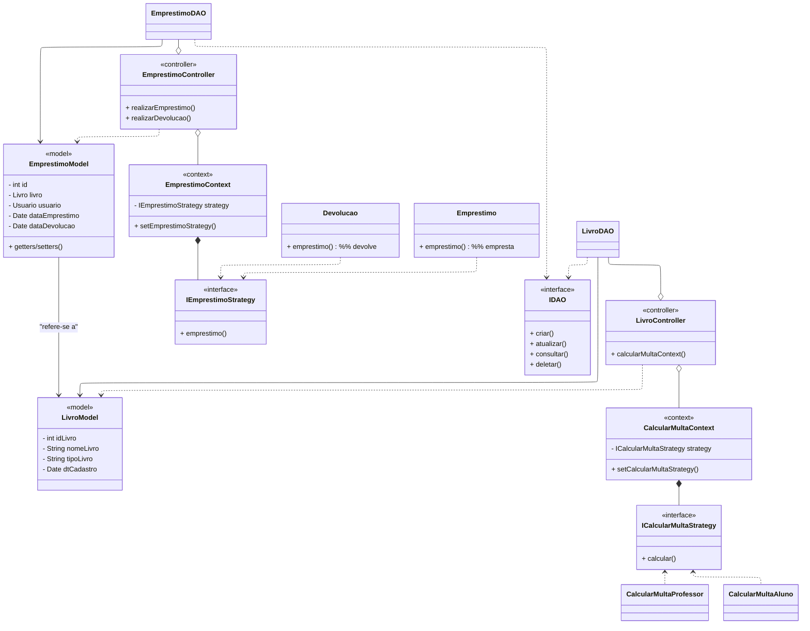

```mermaid
---
config:
  layout: elk
---
classDiagram

%% ================================
%% 📘 CAMADA MODEL
%% ================================
class  EmprestimoModel {
    <<model>>
    - int id
    - Livro livro
    - Usuario usuario
    - Date dataEmprestimo
    - Date dataDevolucao
    + getters/setters()
}

class  LivroModel {
    <<model>>
    - int idLivro
    - String nomeLivro
    - String tipoLivro
    - Date dtCadastro
}

EmprestimoModel --> LivroModel : "refere-se a"

%% ================================
%% ⚙️ CAMADA CONTEXT / STRATEGY - EMPRÉSTIMO
%% ================================
class  IEmprestimoStrategy {
    <<interface>>
    + emprestimo()
}

class  EmprestimoContext {
    <<context>>
    - IEmprestimoStrategy strategy
    + setEmprestimoStrategy()
}

class Devolucao {
    + emprestimo() %% devolve
}

class Emprestimo {
    + emprestimo() %% empresta
}

EmprestimoContext *-- IEmprestimoStrategy
Devolucao ..> IEmprestimoStrategy
Emprestimo ..> IEmprestimoStrategy

%% ================================
%% ⚙️ CAMADA CONTEXT / STRATEGY - MULTA
%% ================================
class  ICalcularMultaStrategy {
    <<interface>>
    + calcular()
}

class  CalcularMultaContext {
    <<context>>
    - ICalcularMultaStrategy strategy
    + setCalcularMultaStrategy()
}

class CalcularMultaProfessor
class CalcularMultaAluno

CalcularMultaContext *-- ICalcularMultaStrategy
ICalcularMultaStrategy <.. CalcularMultaProfessor
ICalcularMultaStrategy <.. CalcularMultaAluno

%% ================================
%% 🧩 CAMADA DAO
%% ================================
class  IDAO {
    <<interface>>
    + criar()
    + atualizar()
    + consultar()
    + deletar()
}

class EmprestimoDAO
class LivroDAO

EmprestimoDAO ..> IDAO
LivroDAO ..> IDAO
EmprestimoDAO --> EmprestimoModel
LivroDAO --> LivroModel

%% ================================
%% 🎯 CAMADA CONTROLLER
%% ================================
class  EmprestimoController {
    <<controller>>
    + realizarEmprestimo()
    + realizarDevolucao()
}

class  LivroController {
    <<controller>>
    + calcularMultaContext()
}

EmprestimoController o-- EmprestimoContext
EmprestimoDAO --o EmprestimoController
EmprestimoController ..> EmprestimoModel

LivroDAO --o LivroController
LivroController ..> LivroModel
LivroController o-- CalcularMultaContext

```
