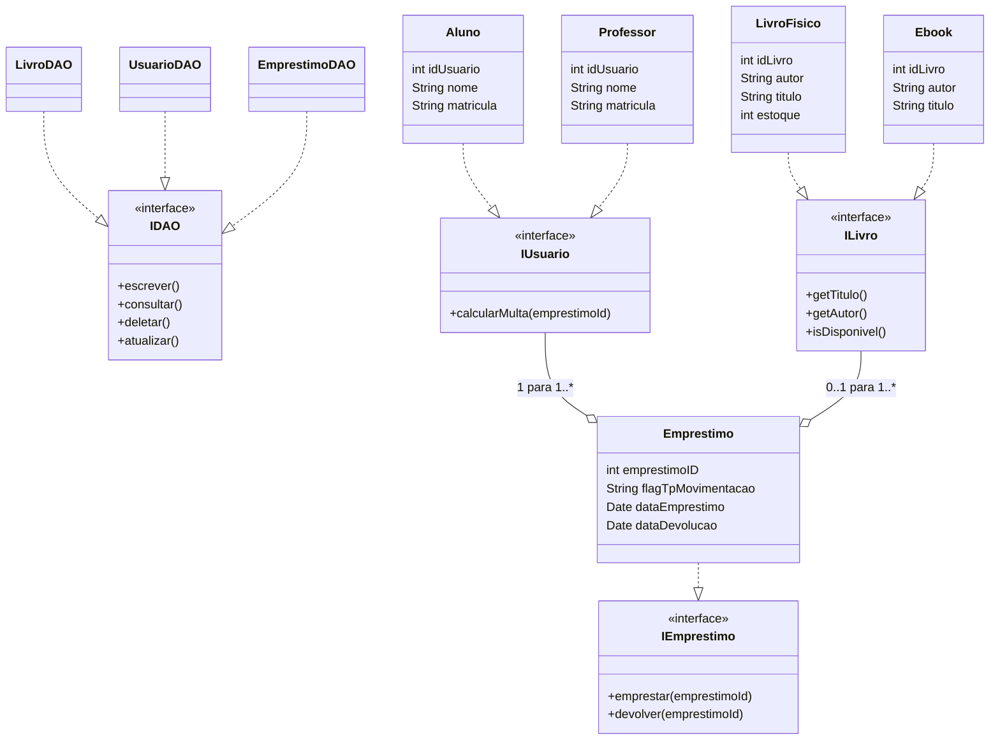

```mermaid
classDiagram
direction TB

%% ==== Interfaces ====
class IDAO {
  <<interface>>
  +escrever()
  +consultar()
  +deletar()
  +atualizar()
}

class ILivro {
  <<interface>>
  +getTitulo()
  +getAutor()
  +isDisponivel()
}

class IUsuario {
  <<interface>>
  +calcularMulta(emprestimoId)
}

class IEmprestimo {
  <<interface>>
  +emprestar(emprestimoId)
  +devolver(emprestimoId)
}

%% ==== Entidades ====
class LivroFisico {
  int idLivro
  String autor
  String titulo
  int estoque
}

class Ebook {
  int idLivro
  String autor
  String titulo
}

class Aluno {
  int idUsuario
  String nome
  String matricula
}

class Professor {
  int idUsuario
  String nome
  String matricula
}

class Emprestimo {
  int emprestimoID
  String flagTpMovimentacao
  Date dataEmprestimo
  Date dataDevolucao
}

%% ==== DAOs ====
class LivroDAO
class UsuarioDAO
class EmprestimoDAO

%% ==== Implementações ====
LivroFisico ..|> ILivro
Ebook ..|> ILivro
Aluno ..|> IUsuario
Professor ..|> IUsuario
LivroDAO ..|> IDAO
UsuarioDAO ..|> IDAO
EmprestimoDAO ..|> IDAO
Emprestimo ..|> IEmprestimo

%% ==== Relações ====
IUsuario --o Emprestimo : 1 para 1..*
ILivro --o Emprestimo : 0..1 para 1..*

```
