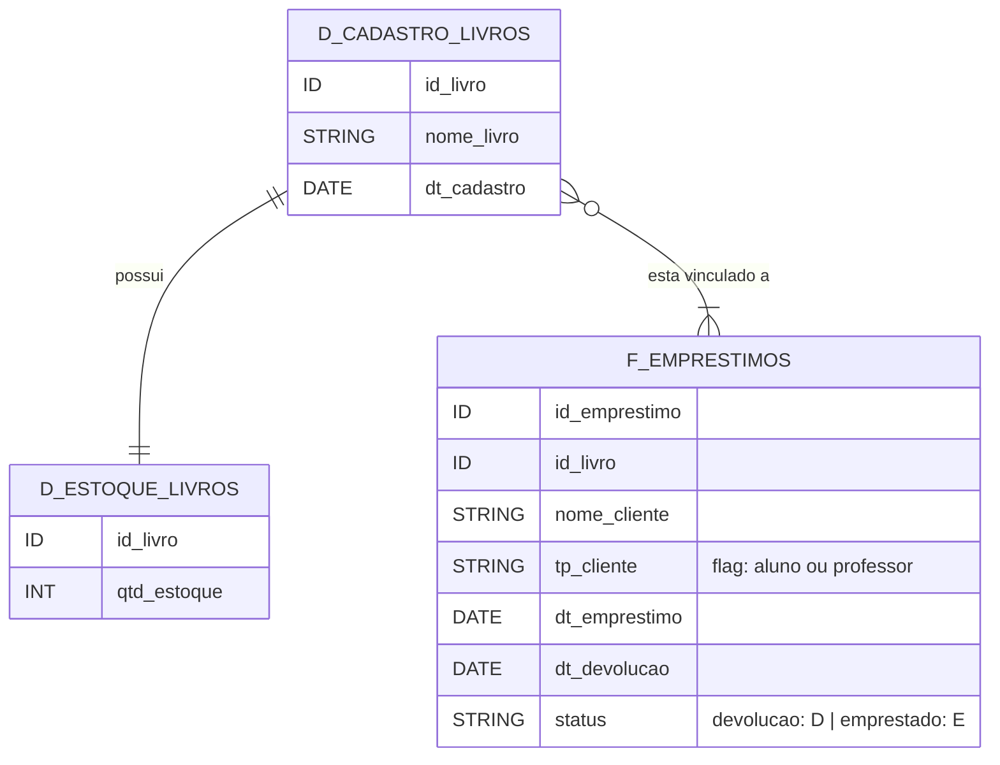

# Diagrama Entidade - Relacionamento
- Demonstra, de forma simples, como as entidades necessárias para uma POC se comportam

```mermaid
erDiagram
    D_CADASTRO_LIVROS{
        ID id_livro
        STRING nome_livro
        DATE dt_cadastro
    }

    D_ESTOQUE_LIVROS{
        ID id_livro
        INT qtd_estoque
    }
    F_EMPRESTIMOS{
        ID id_emprestimo
        ID id_livro
        STRING nome_cliente
        STRING tp_cliente "flag: aluno ou professor"
        DATE dt_emprestimo
        DATE dt_devolucao
        STRING status  "devolucao: D | emprestado: E"

    }

    D_CADASTRO_LIVROS ||--|| D_ESTOQUE_LIVROS: "possui"
    D_CADASTRO_LIVROS }o--|{ F_EMPRESTIMOS: "esta vinculado a"

```
