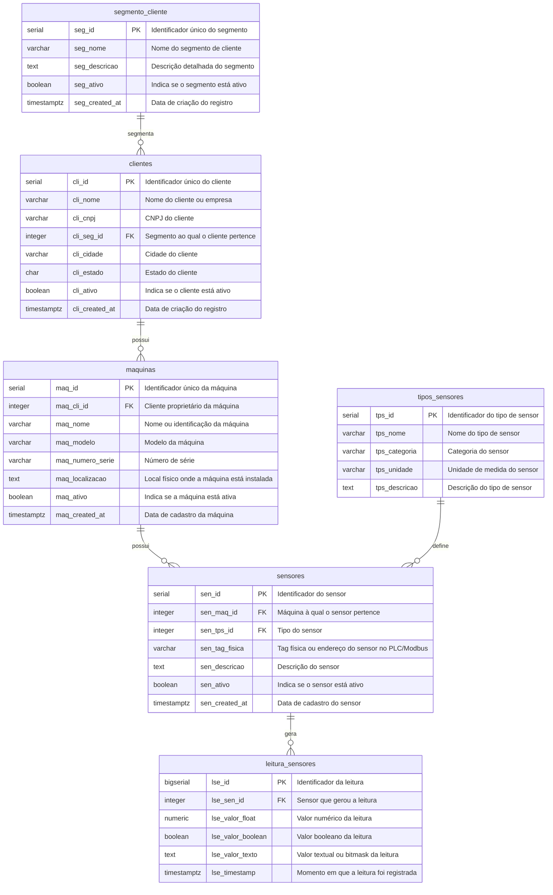

```mermaid
erDiagram
    segmento_cliente {
        serial      seg_id          PK "Identificador único do segmento"
        varchar     seg_nome           "Nome do segmento de cliente"
        text        seg_descricao      "Descrição detalhada do segmento"
        boolean     seg_ativo          "Indica se o segmento está ativo"
        timestamptz seg_created_at     "Data de criação do registro"
    }

    clientes {
        serial      cli_id          PK "Identificador único do cliente"
        varchar     cli_nome           "Nome do cliente ou empresa"
        varchar     cli_cnpj           "CNPJ do cliente"
        integer     cli_seg_id      FK "Segmento ao qual o cliente pertence"
        varchar     cli_cidade         "Cidade do cliente"
        char        cli_estado         "Estado do cliente"
        boolean     cli_ativo          "Indica se o cliente está ativo"
        timestamptz cli_created_at     "Data de criação do registro"
    }

    maquinas {
        serial      maq_id          PK "Identificador único da máquina"
        integer     maq_cli_id      FK "Cliente proprietário da máquina"
        varchar     maq_nome           "Nome ou identificação da máquina"
        varchar     maq_modelo         "Modelo da máquina"
        varchar     maq_numero_serie   "Número de série"
        text        maq_localizacao    "Local físico onde a máquina está instalada"
        boolean     maq_ativo          "Indica se a máquina está ativa"
        timestamptz maq_created_at     "Data de cadastro da máquina"
    }

    tipos_sensores {
        serial  tps_id        PK "Identificador do tipo de sensor"
        varchar tps_nome         "Nome do tipo de sensor"
        varchar tps_categoria    "Categoria do sensor"
        varchar tps_unidade      "Unidade de medida do sensor"
        text    tps_descricao    "Descrição do tipo de sensor"
    }

    sensores {
        serial      sen_id          PK "Identificador do sensor"
        integer     sen_maq_id      FK "Máquina à qual o sensor pertence"
        integer     sen_tps_id      FK "Tipo do sensor"
        varchar     sen_tag_fisica     "Tag física ou endereço do sensor no PLC/Modbus"
        text        sen_descricao      "Descrição do sensor"
        boolean     sen_ativo          "Indica se o sensor está ativo"
        timestamptz sen_created_at     "Data de cadastro do sensor"
    }

    leitura_sensores {
        bigserial   lse_id             PK "Identificador da leitura"
        integer     lse_sen_id         FK "Sensor que gerou a leitura"
        numeric     lse_valor_float       "Valor numérico da leitura"
        boolean     lse_valor_boolean     "Valor booleano da leitura"
        text        lse_valor_texto       "Valor textual ou bitmask da leitura"
        timestamptz lse_timestamp         "Momento em que a leitura foi registrada"
    }

    segmento_cliente ||--o{ clientes         : "segmenta"
    clientes         ||--o{ maquinas         : "possui"
    maquinas         ||--o{ sensores         : "possui"
    tipos_sensores   ||--o{ sensores         : "define"
    sensores         ||--o{ leitura_sensores : "gera"
```
