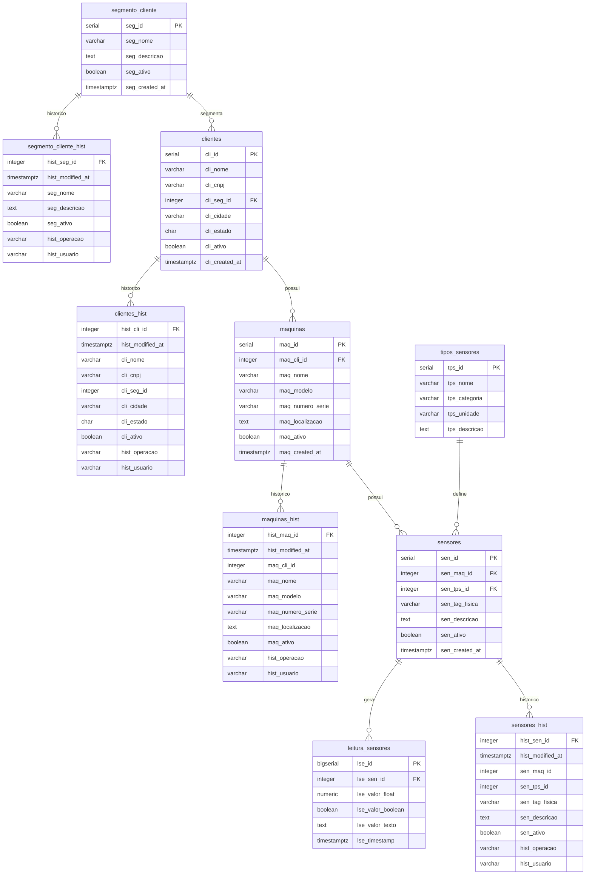

```mermaid
erDiagram
    segmento_cliente {
        serial      seg_id          PK
        varchar     seg_nome
        text        seg_descricao
        boolean     seg_ativo
        timestamptz seg_created_at
    }

    segmento_cliente_hist {
        integer     hist_seg_id     FK
        timestamptz hist_modified_at
        varchar     seg_nome
        text        seg_descricao
        boolean     seg_ativo
        varchar     hist_operacao
        varchar     hist_usuario
    }

    clientes {
        serial      cli_id          PK
        varchar     cli_nome
        varchar     cli_cnpj
        integer     cli_seg_id      FK
        varchar     cli_cidade
        char        cli_estado
        boolean     cli_ativo
        timestamptz cli_created_at
    }

    clientes_hist {
        integer     hist_cli_id     FK
        timestamptz hist_modified_at
        varchar     cli_nome
        varchar     cli_cnpj
        integer     cli_seg_id
        varchar     cli_cidade
        char        cli_estado
        boolean     cli_ativo
        varchar     hist_operacao
        varchar     hist_usuario
    }

    maquinas {
        serial      maq_id          PK
        integer     maq_cli_id      FK
        varchar     maq_nome
        varchar     maq_modelo
        varchar     maq_numero_serie
        text        maq_localizacao
        boolean     maq_ativo
        timestamptz maq_created_at
    }

    maquinas_hist {
        integer     hist_maq_id     FK
        timestamptz hist_modified_at
        integer     maq_cli_id
        varchar     maq_nome
        varchar     maq_modelo
        varchar     maq_numero_serie
        text        maq_localizacao
        boolean     maq_ativo
        varchar     hist_operacao
        varchar     hist_usuario
    }

    tipos_sensores {
        serial  tps_id          PK
        varchar tps_nome
        varchar tps_categoria
        varchar tps_unidade
        text    tps_descricao
    }

    sensores {
        serial      sen_id          PK
        integer     sen_maq_id      FK
        integer     sen_tps_id      FK
        varchar     sen_tag_fisica
        text        sen_descricao
        boolean     sen_ativo
        timestamptz sen_created_at
    }

    sensores_hist {
        integer     hist_sen_id     FK
        timestamptz hist_modified_at
        integer     sen_maq_id
        integer     sen_tps_id
        varchar     sen_tag_fisica
        text        sen_descricao
        boolean     sen_ativo
        varchar     hist_operacao
        varchar     hist_usuario
    }

    leitura_sensores {
        bigserial   lse_id          PK
        integer     lse_sen_id      FK
        numeric     lse_valor_float
        boolean     lse_valor_boolean
        text        lse_valor_texto
        timestamptz lse_timestamp
    }

    segmento_cliente ||--o{ clientes : "segmenta"
    segmento_cliente ||--o{ segmento_cliente_hist : "historico"
    clientes ||--o{ maquinas : "possui"
    clientes ||--o{ clientes_hist : "historico"
    maquinas ||--o{ sensores : "possui"
    maquinas ||--o{ maquinas_hist : "historico"
    tipos_sensores ||--o{ sensores : "define"
    sensores ||--o{ leitura_sensores : "gera"
    sensores ||--o{ sensores_hist : "historico"
```
